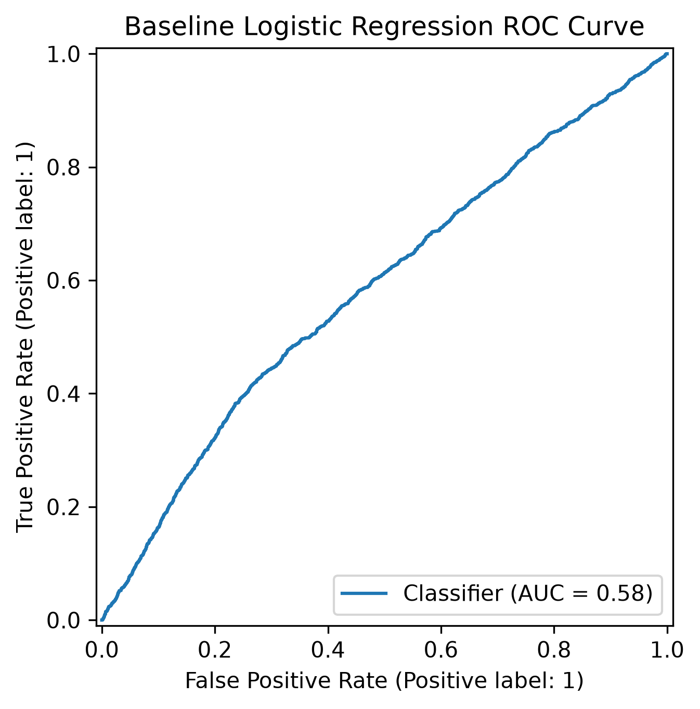
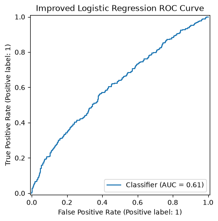
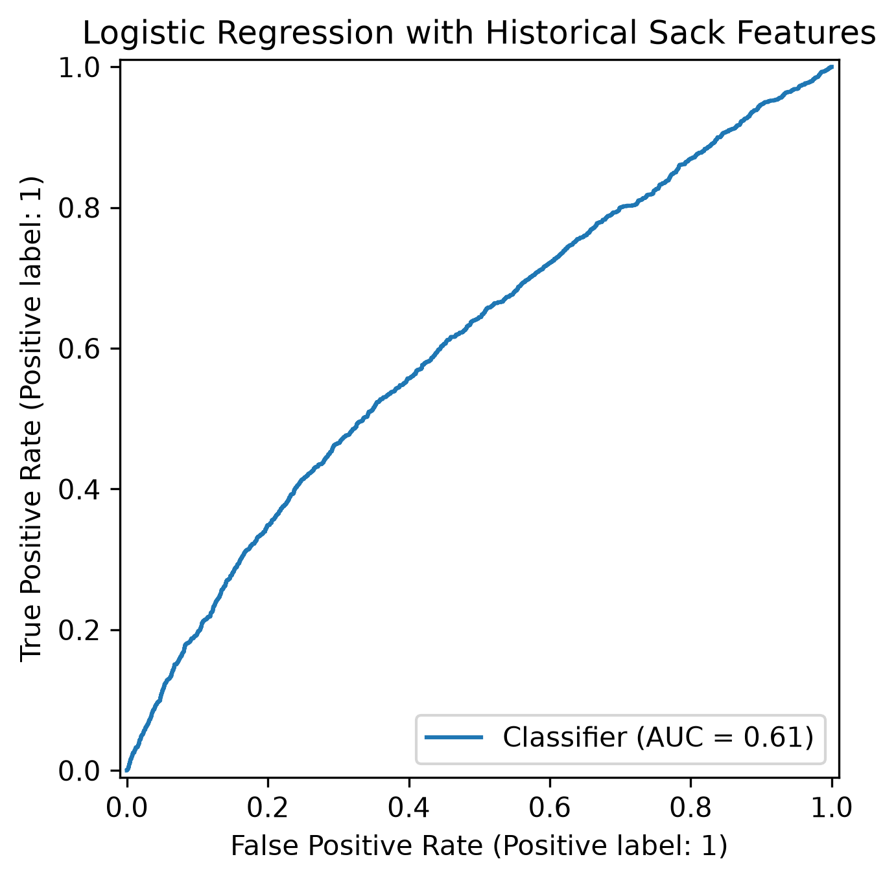
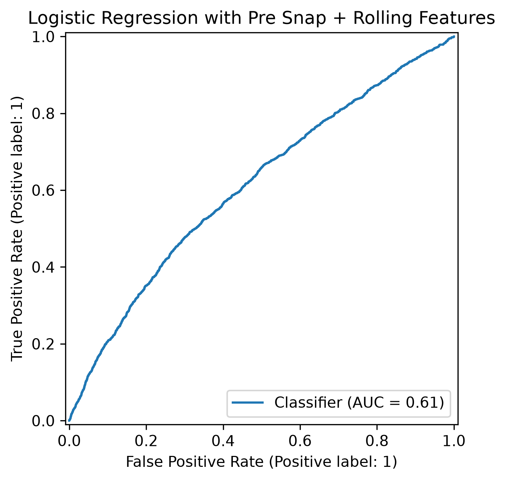
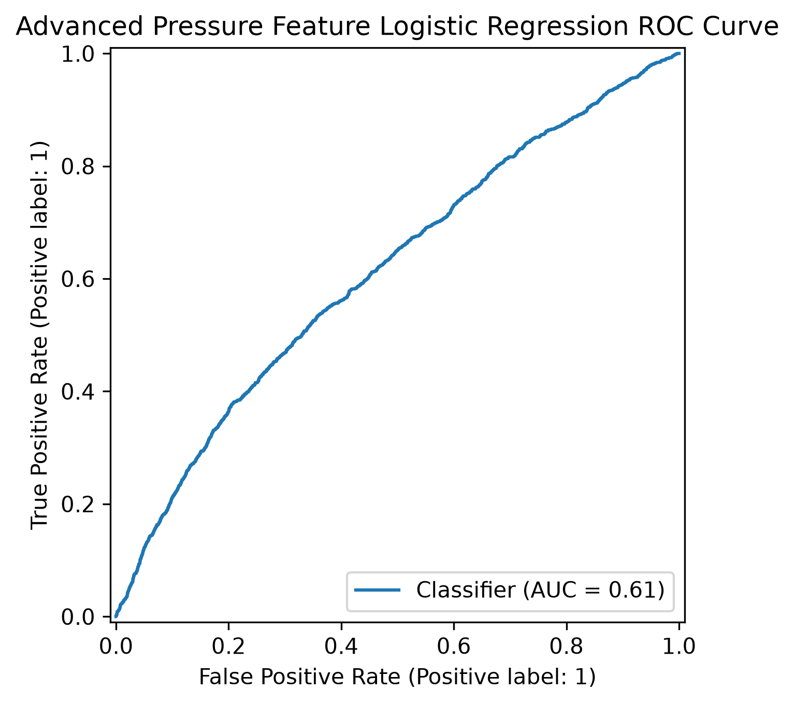
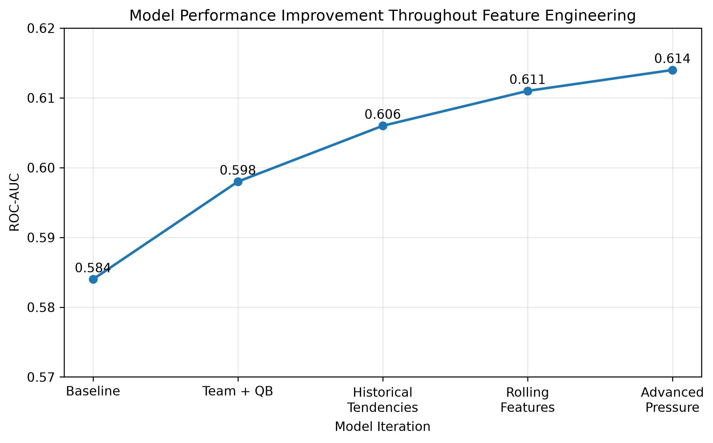
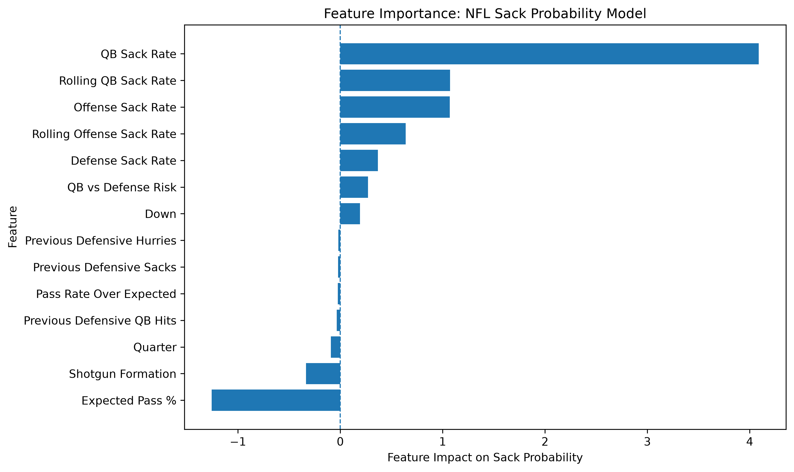
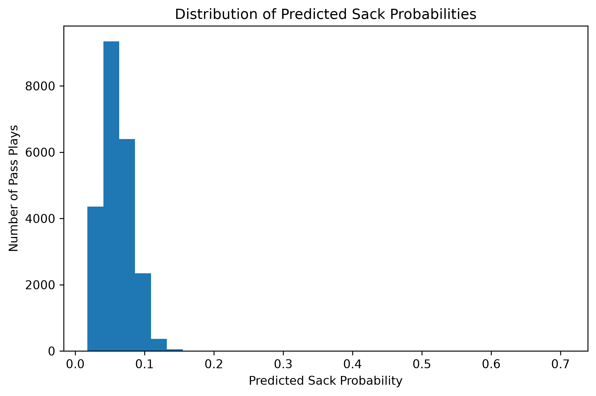
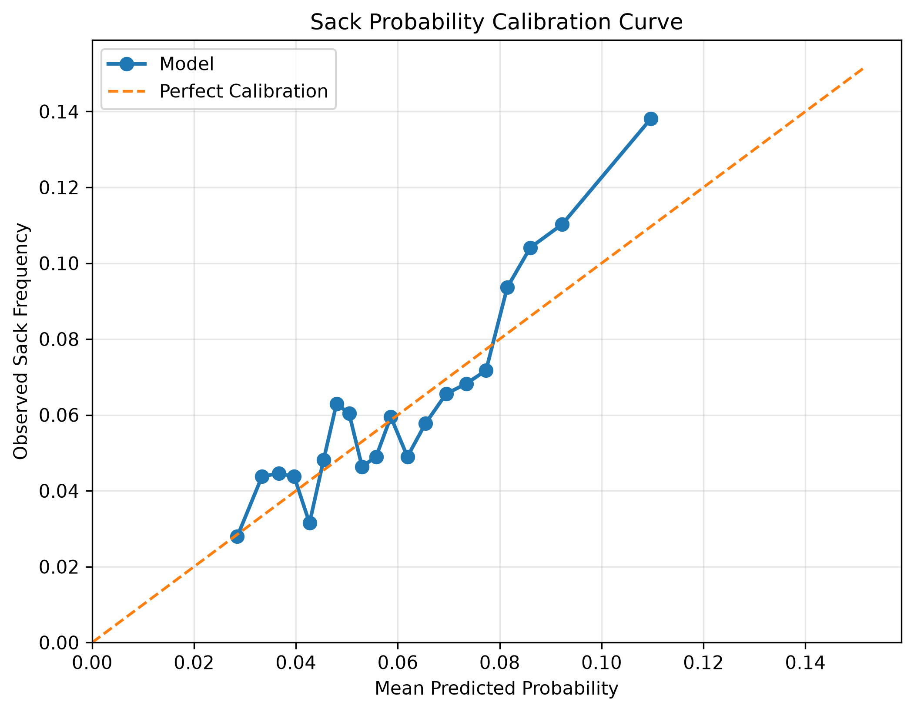
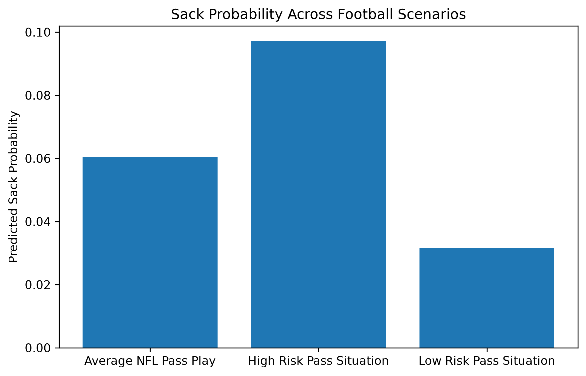

# Predicting NFL Sack Probability: A Pre-Snap Machine Learning Approach

Predicting the probability that an NFL pass play results in a sack.

## Swish Analytics Data Modeling Challenge

## Executive Summary

The final model estimates sack probability before the snap using game situation, quarterback tendencies, offensive tendencies, defensive tendencies, rolling-season performance, and advanced pressure metrics.

The best model achieved a ROC-AUC of 0.614 and a Brier Score of 0.059 while producing reasonably calibrated probability estimates.

Results indicate that quarterback sack tendency, offensive sack tendency, defensive sack tendency, and recent pressure related performance are among the strongest predictors of future sacks.

## Data Sources
- Play-by-play data
- Rosters
- Depth charts
- Snap counts
- Advanced statistics

## Methods

- Exploratory Data Analysis
- Feature Engineering
- Logistic Regression
- Historical Sack Rate Modeling
- Rolling Season Feature Engineering
- Advanced Pressure Metrics
- Probability Calibration
- Model Evaluation (ROC-AUC & Brier Score)

## Final Results

Best Model: Logistic Regression with Historical Tendencies, Rolling Features, and Advanced Pressure Metrics

Performance:
- ROC-AUC: 0.614
- Brier Score: 0.059

The model generates calibrated pre snap probabilities that estimate the likelihood a pass play results in a sack.

## Model Development Timeline

## Initial Results

A baseline logistic regression model was trained using only game state variables:

- Down
- Yards to go
- Yard line
- Quarter
- Game seconds remaining
- Week
- Expected pass probability (xPass)
- Pass Over Expected (Pass OE)

### Baseline Performance

Model | Features | ROC-AUC

- Logistic Regression | Game state features | AUC = 0.584

## ROC Curve

This serves as the benchmark model for future feature engineering and model improvements.

## Next Steps

- Add offensive and defensive team features
- Incorporate quarterback sack tendencies
- Engineer historical pass rush metrics
- Train Gradient Boosting models
- Compare feature importance across models

## Improved Performance

Model | Features | ROC-AUC

- Logistic Regression | Game state features | AUC = 0.584
- Logistic Regression | Game state features + team/QB categorical features | AUC = .597

## Improved ROC Curve

The addition of team and quarterback context improved predictive performance, suggesting that player and team identity contribute meaningful information beyond game state variables alone

## Historical Sack Tendency Features

To better capture perisistent football tendencies, historical sack rate features were engineered using only training season data (2021-2022):

- Quarterback Sack Rate
- Offensive Team Sack Rate Allowed
- Defensive Team Sack Rate Allowed

These features were designed to represent long term tendencies while avoiding information leakage from the evaluation season.

## Historical Sack Rate Model

Model | Features | ROC-AUC

- Logistic Regression | Game state features | AUC = 0.584
- Logistic Regression | Game state features + team/QB categorical features | AUC = .597
- Logistic Regression | Historical Sack Rate Features | AUC = .605

## Historical Feature ROC Curve

This model directly incorporates football specific tendencies and provides insight into which quarterbacks, offenses, and defenses are most associated with sack outcomes.

## Key Findings

Results indicate that:

- Game state variables alone provide modest predictive power.
- Team and quarterback identity improve model performance.
- Historical sack tendencies contain additional predictive signal.
- Sack probability appears to be influenced by both situational factors and persistent player/team characteristics.

## Pre-Snap and Rolling Sack Features

Additional features were engineered to better simulate real pre snap prediction:

- Season to date quarterback sack rate
- Season to date offensive sack rate
- Season to date defensive sack rate
- Quarterback vs Defense sack risk interaction
- Offense vs Defense sack risk interaction
- Shotgun indicator

These features increased predictive performance by incorporating recent team and quarterback tendencies.

ROC-AUC: 0.611

## Rolling Feature ROC Curve

## Model Progression
Model | Features | ROC-AUC

- Logistic Regression | Game state features | AUC = 0.584
- Logistic Regression | Game state features + team/QB categorical features | AUC = .597
- Logistic Regression | Historical Sack Rate Features | AUC = .605
- Logistic Regression | Pre-Snap + Rolling Features | AUC =	0.611

Best model: 0.611 ROC-AUC

## Key Findings

Results suggest:

- Quarterback sack tendency is one of the strongest predictors of sacks.
- Defensive pass rush tendency provides additional predictive signal.
- Situational football context remains important.
- Recent performance and rolling season tendencies improve prediction beyond long term averages.
- Matchup specific features appear more informative than team identity alone.

## Future Improvements

The project is focused on integrating advanced pressure metrics, offensive line information, depth chart data, and snap count information to improve predictive performance.

Potential future improvements include:

- Offensive line player-level metrics
- Individual pass-rusher metrics
- Personnel grouping features
- Coverage and blitz indicators
- Tracking-data features
- Tree-based machine learning models

## Advanced Pressure Metrics

Weekly advanced quarterback/offensive pressure metrics and defensive pressure metrics were added to the modeling dataset.

Features included:

- Previous week times sacked
- Previous week times pressured
- Previous week times hurried
- Previous week times hit
- Previous week pressure percentage
- Previous week defensive sacks
- Previous week defensive pressures
- Previous week defensive QB hits

All advanced statistics were shifted by one week to avoid data leakage and better simulate what would be known before a game.

## Rolling Feature ROC Curve

##  Model Progression
Model | Features | ROC-AUC

- Logistic Regression | Game state features | AUC = 0.584
- Logistic Regression | Game state features + team/QB categorical features | AUC = .597
- Logistic Regression | Historical Sack Rate Features | AUC = .605
- Logistic Regression | Pre-Snap + Rolling Features | AUC =	0.611
- Logistic Regression | Advanced Pressure Features | AUC = 0.614 

Best model: 0.614 ROC-AUC

The advanced pressure model is the  best performer, though logistic regression showed some convergence sensitivity as the feature set became more complex.

### Most Influential Features

### Key Findings

- Quarterback sack rate was the strongest predictor in the final model.
- Offensive sack tendencies were highly predictive of future sacks.
- Rolling season performance provided additional signal beyond historical averages.
- Defensive sack rates remained important after controlling for game state.
- Matchup-specific risk features improved prediction but were less influential than quarterback tendencies.

## Individual Sack Probability Predictions

The best model was used to generate sack probabilities for individual pass plays.

Most pass plays received predicted sack probabilities between 3% and 10%, which aligns with observed NFL sack frequencies.

This represents the primary objective of the project: estimating the probability that a pass play results in a sack before the snap.

## Probability Calibration

Because the objective is probability estimation rather than simple classification, calibration was evaluated in addition to ROC-AUC.

Evaluation methods included:

- Calibration Curve
- Brier Score
- Probability Bucket Analysis

Results showed that higher predicted sack probabilities corresponded to higher observed sack frequencies.

Brier Score: 0.059

This indicates that the model's probability estimates are reasonably aligned with actual outcomes.

## Feature Importance

To better understand what drives sack probability predictions, the coefficients from the final logistic regression model were examined.

Quarterback sack tendency emerged as the strongest predictor, followed by offensive sack tendencies, rolling season sack rates, and defensive sack generation.

These results suggest that sacks are heavily influenced by persistent quarterback and offensive behaviors, while defensive pressure metrics provide additional predictive signal.

## Interpreting Sack Probability Predictions

The final model was used to estimate sack probabilities for individual pass plays.

Key findings:

- Average NFL pass play: ~6% sack probability
- High risk passing situations generated substantially higher predicted probabilities
- Low risk passing situations generated substantially lower predicted probabilities
- Quarterback sack tendency, offensive sack tendency, and defensive pass rush strength were the strongest contributors to elevated sack risk

This section demonstrates the practical application of the model by translating predictions into football-specific scenarios rather than focusing solely on model performance metrics.

## Conclusion

This project developed a machine learning framework for estimating the probability that an NFL pass play results in a sack before the snap.

Starting with game state variables alone, multiple rounds of football specific feature engineering were applied, including historical sack tendencies, rolling season performance metrics, matchup risk indicators, and advanced pressure statistics.

The final model achieved a ROC-AUC of 0.614 and a Brier Score of 0.059 while producing calibrated probability estimates for individual pass plays.

Results suggest that quarterback sack tendency, offensive protection performance, defensive pass rush strength, and recent pressure related trends are among the strongest predictors of future sacks.

Most importantly, the final model successfully answers the original challenge question by generating pre snap sack probabilities for individual NFL pass plays.

## Author

Ethan Friedman